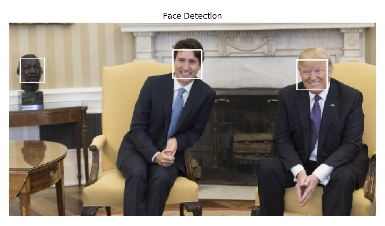
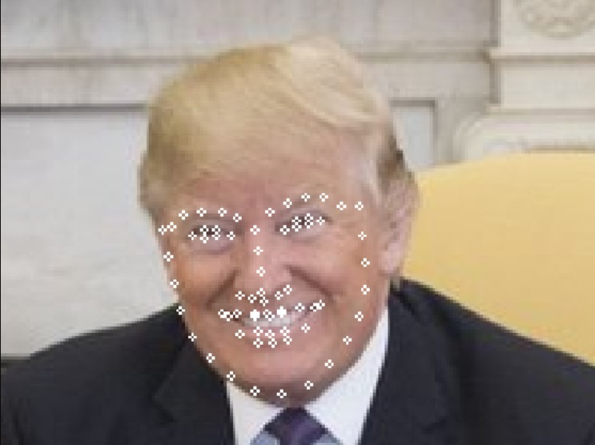
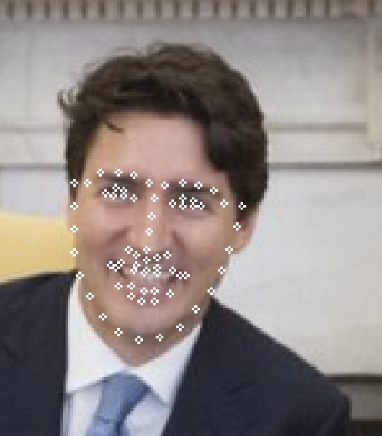
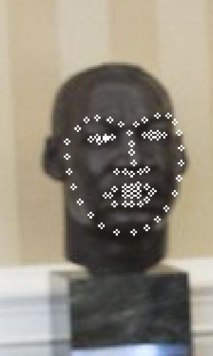

# Facial-landmark-detection
### Face Detection

This detects faces and facial landmarks on an image, the image can be access via a url or in local directory.

This project uses Python 3.7 and openCV 4.1.2

The model used for landmark detection can be got from: 
https://github.com/kurnianggoro/GSOC2017/raw/master/data/lbfmodel.yaml

Also the model used for face detection can be found here:
https://raw.githubusercontent.com/opencv/opencv/master/data/haarcascades/haarcascade_frontalface_alt2.xml

Improvement would be made to capture from video and webcam.

## Result Samples

#### Landmark Detection

### Credits

https://github.com/albertofernandezvillan
 https://github.com/kurnianggoro/GSOC2017
 https://github.com/sacchitchadha
 https://github.com/tensorflowlagos
